# InstAgent


## 🚀 Instant AI Multi-Agent Systems at Your Fingertips

**InstAgent** transforms the way you build AI agent systems. With just a text description, watch as sophisticated multi-agent networks spring to life - complete with specialized roles, intelligent tool selection, and ready-to-run Multi-Agent System.

> *"From concept to code in seconds - InstAgent bridges the gap between imagination and implementation."*

No more complex configuration, no more struggling with agent architecture. Simply describe what you want, and let InstAgent handle the rest.

## ✨ Why InstAgent?

- **Zero to Agent in Seconds**: Describe your needs in plain English, get a full agent system instantly
- **Expert-Level Architecture**: Creates optimized agent teams that would take experts hours to design manually
- **Seamless Tool Integration**: Automatically assigns the perfect tools to each specialized agent
- **Ready-to-Execute Code**: Generate fully functional multi-agent systems with robust workflows and connections
- **Visualization Included**: See your agent network come alive with interactive workflow diagrams
- **Enhanced Functionality with Composio**: Leverages Composio MCP to equip AI agents with over 100 high-quality integrations, enabling seamless function calling and tool usage across various platforms.

## 🛠️ How It Works

InstAgent employs a powerful three-stage pipeline:

1. **Team Architect** - Analyzes your task and designs the perfect team of specialized agents
2. **Tool Specialist** - Equips each agent with exactly the tools they need to excel
3. **Code Synthesizer** - Transforms your agent design into fully functional Multi-Agent System

## 💻 Getting Started

Embark on your journey with InstAgent effortlessly! Whether you prefer a quick online experience or a comprehensive local setup, we've got you covered. Choose the option that best suits your needs:

### Option 1: Try InstAgent Online

Dive into InstAgent directly from your browser with no installation required. Click the link below to start exploring the power of InstAgent instantly:

- [Try InstAgent Online](https://instagent.streamlit.app/)

### Option 2: 🐳 Docker Setup

InstAgent can be easily run in a Docker container, eliminating the need to manage dependencies on your local machine.

### Prerequisites

- <a href="https://docs.docker.com/get-docker/" target="_blank">Docker</a>
- <a href="https://docs.docker.com/compose/install/" target="_blank">Docker Compose</a> (optional but recommended)

1. **Clone the repository**
   ```bash
   git clone https://github.com/akhil-bot/InstAgent.git
   cd InstAgent
   ```

2. **Build and run the container**
   ```bash
   docker-compose up -d
   ```

3. **Access InstAgent**
   
   Open your browser and navigate to <a href="http://localhost:8502" target="_blank">http://localhost:8502</a>

4. **Stop the container**
   ```bash
   docker-compose down
   ```

### Option 3: Local Installation

Set up InstAgent on your local machine to fully customize and control your agent systems. Follow these steps to get started:

1. **Clone the repository**
   ```bash
   git clone https://github.com/akhil-bot/InstAgent.git
   cd InstAgent
   ```

2. **Create a virtual environment(Use Python 3.10 or higher)**
   ```bash
   python -m venv venv
   source venv/bin/activate # On Windows: venv\Scripts\activate
   ```

3. **Install dependencies**
   ```bash
   pip install -r requirements.txt
   ```

4. **Set up Composio API Key**

   To use Composio's features, you'll need to set up your Composio API key. Follow the instructions provided in the <a href="https://docs.composio.dev/getting-started/quickstart" target="_blank">Composio Quickstart Guide</a> to obtain and configure your API key.

5. **Launch InstAgent**

   ```bash
   streamlit run main.py
   ```

### Create Your First Agent System in 3 Simple Steps

1. **Enter your task description** - Be as specific or general as you like or select from the examples section
2. **Click "Generate Agent"** - Watch the three-stage process unfold
3. **Use the generated code** - Download as a project or copy the Multi-Agent System implementation

### Example Usage

**Input Task:**
```
Design a research team that analyzes financial markets and generates investment recommendations.
```

**What You'll Get:**
- A specialized team of agents (Market Analyzer, Data Specialist, Investment Strategist)
- Strategic tool assignments for each agent
- Complete, ready-to-run Multi-Agent System implementation
- And a complete Agentic system as a project which can be downloaded as a zip file and used in any IDE

## 📊 Workflow Visualization

InstAgent provides an intuitive interface to track and visualize your agent creation process:

- **Progress Tracking**: Watch as each stage of creation completes
- **Interactive Team View**: Explore agent roles, goals, and connections
- **Tool Assignment Overview**: See which tools are assigned to which agents
- **Code Preview**: Review the generated code before downloading

### Agent Flowchart

```mermaid
graph TD;
    A[Start] --> B[👥 Team Creator];
    B --> C[🛠️ Tool Picker];
    C --> D[💻 Code Generator];
    D --> E[End];
```



- **Start**: The beginning of the agent creation process.
- **Team Creator**: Analyzes the task and designs the team.
- **Tool Picker**: Selects the appropriate tools for each agent.
- **Code Generator**: Generates the code for the multi-agent system.
- **End**: Completion of the agent creation process.

## 🔍 Technical Details

InstAgent leverages:

- **LangGraph**: For agent orchestration and workflow management
- **Composio**: For seamless integration of tools and it's usage
- **Streamlit**: For the intuitive user interface


The system uses a state-of-the-art approach to:
1. Parse your natural language requirements
2. Model an optimal team structure
3. Select appropriate tools for each agent
4. Generate syntactically correct, ready-to-deploy Python code

## 🤝 Contributing

Contributions to InstAgent are welcome! Here's how you can help:

1. **Fork** the repository
2. **Create a branch** for your feature (`git checkout -b feature/amazing-feature`)
3. **Commit** your changes (`git commit -m 'Add some amazing feature'`)
4. **Push** to the branch (`git push origin feature/amazing-feature`)
5. **Open a Pull Request**

## 💡 Feature Requests

We welcome your ideas and suggestions! To request a new feature, please start a <a href="https://github.com/akhil-bot/InstAgent/discussions" target="_blank">discussion</a> on our GitHub repository.

## 📄 License

This project is licensed under the MIT License - see the LICENSE file for details.

## 📞 Contact

- **Issues**: Please use the <a href="https://github.com/akhil-bot/InstAgent/issues" target="_blank">GitHub issues page</a> for bug reports and feature requests
- **Email**: akhil.230299@gmail.com
- **LinkedIn**: <a href="https://www.linkedin.com/in/akhil-sainath-maddala-4b9830185/" target="_blank">Akhil Maddala</a>

## 🙏 Acknowledgements

- This project uses <a href="https://github.com/langchain-ai/langgraph" target="_blank">Langgraph</a> for agent orchestration
- UI built with <a href="https://streamlit.io/" target="_blank">Streamlit</a>
- LLM capabilities powered by <a href="https://openai.com/" target="_blank">OpenAI</a>

## 🌟 Explore More Agentic Systems

If you enjoyed InstAgent, be sure to check out my other innovative agentic systems! These are agents that can automate your day-to-day activities, making your life easier and more efficient. Each project is designed to push the boundaries of what's possible with AI, offering unique features and capabilities. Visit my <a href="https://github.com/akhil-bot" target="_blank">GitHub profile</a> to discover more cutting-edge solutions and join the journey of transforming AI development.


## 🌟 Support InstAgent

If you find InstAgent helpful or insightful, please consider giving it a star on GitHub! Your support helps us continue to improve and develop new features. Thank you for being a part of our community!

---

*From concept to code in seconds* - InstAgent is redefining what's possible with multi-agent systems.
