# InstAgent


## 🚀 Instant Multi-Agent Systems at Your Fingertips

**InstAgent** transforms the way you build AI agent systems. With just a text description, watch as sophisticated multi-agent networks spring to life - complete with specialized roles, intelligent tool selection, and ready-to-run Multi-Agent System.

> *"From concept to code in seconds - InstAgent bridges the gap between imagination and implementation."*

No more complex configuration, no more struggling with agent architecture. Simply describe what you want, and let InstAgent handle the rest.

## ✨ Why InstAgent?

- **Zero to Agent in Seconds**: Describe your needs in plain English, get a full agent system instantly
- **Expert-Level Architecture**: Creates optimized agent teams that would take experts hours to design manually
- **Seamless Tool Integration**: Automatically assigns the perfect tools to each specialized agent
- **Ready-to-Execute Code**: Generate fully functional multi-agent systems with robust workflows and connections
- **Visualization Included**: See your agent network come alive with interactive workflow diagrams

## 🛠️ How It Works

InstAgent employs a powerful three-stage pipeline:

1. **Team Architect** - Analyzes your task and designs the perfect team of specialized agents
2. **Tool Specialist** - Equips each agent with exactly the tools they need to excel
3. **Code Synthesizer** - Transforms your agent design into fully functional Multi-Agent System

## 📋 Installation

1. **Clone the repository**
   ```bash
   git clone https://github.com/yourusername/instagent.git
   cd instagent
   ```

2. **Install dependencies**
   ```bash
   pip install -r requirements.txt
   ```

3. **Environment Setup**
   - Create a `.env` file with your OpenAI API key (optional)
   ```
   OPENAI_API_KEY=your_api_key_here
   ```

## 💻 Getting Started

### Launch InstAgent

```bash
streamlit run main.py
```

### Create Your First Agent System in 3 Simple Steps

1. **Enter your task description** - Be as specific or general as you like or select from the examples section
2. **Click "Generate Agent"** - Watch the three-stage process unfold
3. **Use the generated code** - Download as a project or copy the Multi-Agent System implementation

### Example Usage

**Input Task:**
```
Design a research team that analyzes financial markets and generates investment recommendations.
```

**What You'll Get:**
- A specialized team of agents (Market Analyzer, Data Specialist, Investment Strategist)
- Strategic tool assignments for each agent
- Complete, ready-to-run Multi-Agent System implementation

## 📊 Workflow Visualization

InstAgent provides an intuitive interface to track and visualize your agent creation process:

- **Progress Tracking**: Watch as each stage of creation completes
- **Interactive Team View**: Explore agent roles, goals, and connections
- **Tool Assignment Overview**: See which tools are assigned to which agents
- **Code Preview**: Review the generated code before downloading

### Agent Flowchart

```mermaid
graph TD;
    A[Start] --> B[👥 Team Creator];
    B --> C[🛠️ Tool Picker];
    C --> D[💻 Code Generator];
    D --> E[End];
```



- **Start**: The beginning of the agent creation process.
- **Team Creator**: Analyzes the task and designs the team.
- **Tool Picker**: Selects the appropriate tools for each agent.
- **Code Generator**: Generates the code for the multi-agent system.
- **End**: Completion of the agent creation process.

## 🔍 Technical Details

InstAgent leverages:

- **LangGraph**: For agent orchestration and workflow management
- **Composio**: For seamless integration of tools and it's usage
- **Streamlit**: For the intuitive user interface


The system uses a state-of-the-art approach to:
1. Parse your natural language requirements
2. Model an optimal team structure
3. Select appropriate tools for each agent
4. Generate syntactically correct, ready-to-deploy Python code

## 🤝 Contributing

Contributions to InstAgent are welcome! Here's how you can help:

1. **Fork** the repository
2. **Create a branch** for your feature (`git checkout -b feature/amazing-feature`)
3. **Commit** your changes (`git commit -m 'Add some amazing feature'`)
4. **Push** to the branch (`git push origin feature/amazing-feature`)
5. **Open a Pull Request**

## 📄 License

This project is licensed under the MIT License - see the LICENSE file for details.

## 📞 Contact

- **Issues**: Please use the GitHub issues page for bug reports and feature requests
- **Email**: akhil.230299@gmail.com
- **LinkedIn**: [Akhil Maddala](https://www.linkedin.com/in/akhil-sainath-maddala-4b9830185/)

## 🙏 Acknowledgements

- This project uses [Langgraph](https://github.com/langchain-ai/langgraph) for agent orchestration
- UI built with [Streamlit](https://streamlit.io/)
- LLM capabilities powered by [OpenAI](https://openai.com/)

---

*From concept to code in seconds* - InstAgent is redefining what's possible with multi-agent systems.
